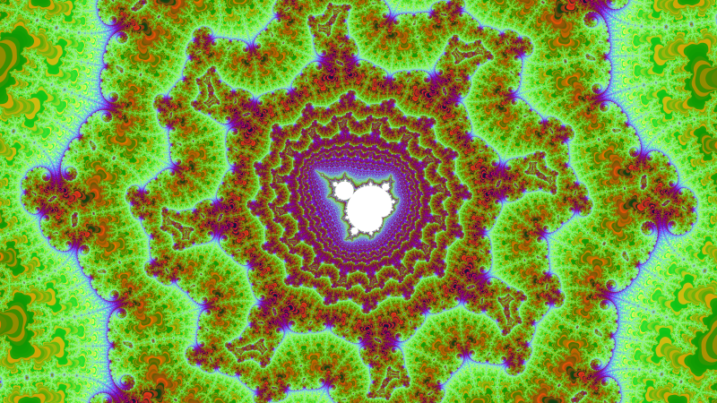
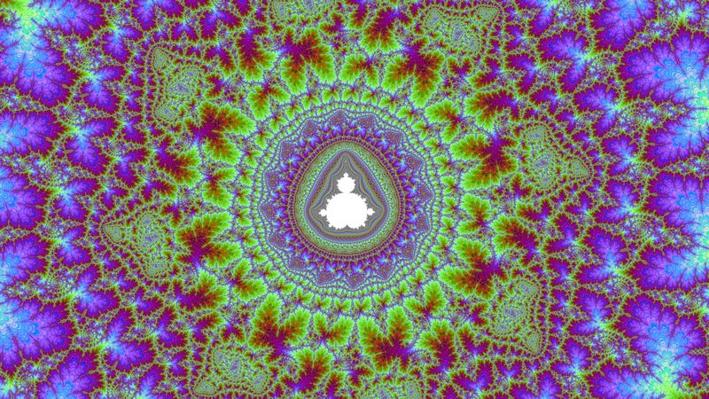

[English](#english) | [Русский](#russian)
<a name="english"></a>

# Mandelbrot set. 24-bit TrueColor. 80-bit long double. OpenMP. Supersampling 8x8 (64 passes). Colors

## True 24-bit BGR
Migrated to full 24-bit BGR color output, enabling smooth gradients and millions of unique shades.
By utilizing a native 24-bit BGR pipeline, the engine can render millions of intermediate colors.


## High-Precision Rendering (80-bit)
Most Mandelbrot explorers use standard **64-bit double precision**, which leads to "pixelation" at zoom levels around $10^{14}$. 
This project leverages **80-bit Extended Precision Arithmetic** (`long double`) to push the boundaries of the fractal:

*   **My Implementation (80-bit):** Provides **4 extra decimal digits** of precision, allowing you to explore **10,000x deeper** ($10^{18}$ range).
*   **Hardware Optimized:** Directly utilizes the **x87 FPU registers** for maximum mathematical depth.

## OpenMP
OpenMP is a standard that tells the compiler, "Take this loop and distribute the iterations among the different processor cores."
Yes, using OpenMP you are doing parallel programming at the Multithreading level.
Everything is powered by **OpenMP** parallel loops for maximum performance.
OpenMP - Scalability: Your code will run equally efficiently on a 4-core laptop and a 128-core server.


## 8x8 Supersampling (64 Samples Per Pixel): Direct RGB-Space Integration
I decided to take the visual quality to a completely different level. This engine implements
True 8x8 Supersampling Anti-Aliasing (SSAA) with 64 independent samples per single screen pixel, utilizing Direct RGB-Space Integration.
Instead of a standard 1920x1080 render, the engine internally processes a massive 15,360 x 8,640 sub-pixel grid!
After calculating all 64 samples for a pixel, they are downsampled into one.
Key Technical Advantages:

*    64-Point Fractal Sampling: Each final screen pixel is computed from sixty-four independent fractal coordinate points.
*    High-Precision Per-Channel RGB Accumulation: The engine first calculates the specific 24-bit color for every single sub-pixel before performing any blending.
*    Noise Elimination: By accumulating color intensities (R, G, B) rather than raw iteration counts, we completely eliminate "chromatic noise." The result is a crystal-clear, razor-sharp image where every micro-filament is perfectly reconstructed.
*    True Color Integration: Our solution performs integration directly in the RGB color space. By computing the exact Red, Green, and Blue components for each sub-pixel before downsampling, we achieve a cinematic level of smoothness and structural integrity that 8-bit or iteration-based renderers simply cannot match.


## Visual Aesthetics. Color
The engine uses a sophisticated hybrid approach to color mapping.
Smooth Transitions (Blue & Green): These channels are driven by phase-shifted sine and cosine waves (127 + 127 * 2 * pi * sin / cos).
This creates deep, hypnotic gradients.
High-Frequency Contrast (Red): The Red channel is populated using a pseudo-random distribution (stochastic noise).
The "Shimmer" Effect: By mixing smooth harmonic oscillations (G, B) with per-index noise (R), the renderer achieves a unique shimmering texture. 
The juxtaposition of rhythmic Green/Blue waves and 'noisy' Red values. It mimics the visual complexity.


## Look at the results! The smoothness is incredible 





## Controls & Hotkeys
1-5 is one of five different locations on the Mandelbrot set. When you select one, the program will generate a TrueColor 1920 x 1080 Mandelbrot.bmp.

```C++
absc = -1.39966699645936; ordi = 0.0005429083913; size_val = 0.000000000000036;
absc = -0.5503321035926785; ordi = 0.62593891595488; size_val = 0.00000000000026;
absc = -1.39968383250956; ordi = -0.000552555016; size_val = 0.000000000026;
absc = -0.8069595889803; ordi = -0.1593850218137; size_val = 0.00000000007;
absc = -0.6187324844067; ordi = -0.4566028912292; size_val = 0.00000000025;
```

A 6 - reads Mandelbrot.txt - three lines from the file and IT will be TrueColor 1920 by 1080 Mandelbrot.bmp


**[Download Latest Version (Windows & Linux)](https://github.com/Divetoxx/Mandelbrot/releases)**


<a name="russian"></a>
# Множество Мандельброта. 24-бит TrueColor. 80-бит long double. OpenMP. Суперсэмплинг 8x8 (64 прохода). Цвета

 
## True 24-bit BGR
Переход на полную 24-битную цветопередачу BGR, обеспечивающую плавные градиенты.
Это позволяет отображать миллионы оттенков.
Наш движок работает в честном 24-битном цветовом пространстве, может отображать миллионы промежуточных цветов.


## Высокоточная отрисовка (80-бит)
Большинство исследователей фрактала Мандельброта используют стандартную **64-битную двойную точность**,
что приводит к "пикселизации" при масштабировании около $10^{14}$.
В этом проекте используется **80-битная арифметика с расширенной точностью** (<long double>) для расширения границ фрактала:

* **Моя реализация (80-бит):** Обеспечивает **4 дополнительных десятичных знака** точности, позволяя исследовать **в 10 000 раз глубже** (диапазон $10^{18}$).
* **Аппаратная оптимизация:** Непосредственно использует **регистры FPU x87** для максимальной глубины математических вычислений.


## OpenMP
OpenMP - это стандарт, который говорит компилятору: "Возьми этот цикл и сам раздай итерации разным ядрам процессора".
Используя OpenMP, вы занимаетесь параллельным программированием на уровне многопоточности (Multithreading).
OpenMP - масштабируемость: ваш код будет одинаково эффективно работать как на 4-ядерном ноутбуке,
так и на 128-ядерном сервере.


## Суперсэмплинг 8x8 (64 прохода на один пиксель) прямая интеграция в RGB-пространство
И я решил - будет совершенно другой уровень качества. Я реализовал честный суперсэмплинг (антиалиасинг) - со
сглаживанием 8x8 (64 прохода на один пиксель). Прямая интеграция в RGB-пространство.
То есть не **1920 на 1080** пикселя а в 8x8 больше! **15360 на 8640** пикселя! А потом эти 64 прохода уменьшают на один пиксель.
Каждый пиксель экрана вычисляется из шестьдесят четырех независимых точек фрактальных координат.
Высокоточное поканальное накопление RGB. Механизм сначала вычисляет цвет для каждого субпикселя, а затем выполняет средневзвешенное значение их интенсивностей.
Сначала накапливая 24-битные значения цвета, мы полностью устраняем этот шум. В результате получается чистое и четкое изображение.
Наше решение осуществляет интеграцию в цветовом пространстве RGB. Вычисляя конкретные компоненты RGB для каждого субпикселя
перед субдискретизацией.


## Визуальная эстетика. Цвета
В движке используется сложный гибридный подход к отображению цветов.
Плавные переходы (синий и зеленый): Эти каналы управляются сдвинутыми по фазе синусоидальными и косинусоидальными волнами (127 + 127 * 2 * pi * sin/cos).
Это создает глубокие гипнотические градиенты.
Высокочастотный контраст (красный): Красный канал заполняется с использованием псевдослучайного распределения (стохастический шум).
Эффект "Мерцания": смешивая плавные гармонические колебания (G, B) с индексным шумом (R), средство визуализации достигает уникальной мерцающей текстуры.
Сопоставление ритмичных волн G/B и "шумного" красного цвета. Это имитирует визуальную сложность.


## Посмотрите на результаты! Невероятная плавность работы


## Горячие клавиши
С 1-5 - это одно из пяти разных мест Множество Мандельброта. Когда вы выберите одно, то программа будет 1920 на 1080 делать Mandelbrot.bmp 

```C++
absc = -1.39966699645936; ordi = 0.0005429083913; size_val = 0.000000000000036;
absc = -0.5503321035926785; ordi = 0.62593891595488; size_val = 0.00000000000026;
absc = -1.39968383250956; ordi = -0.000552555016; size_val = 0.000000000026;
absc = -0.8069595889803; ordi = -0.1593850218137; size_val = 0.00000000007;
absc = -0.6187324844067; ordi = -0.4566028912292; size_val = 0.00000000025;
```

А 6 - читает Mandelbrot.txt - три строки из файла и ЕГО будет 1920 на 1080 делать Mandelbrot.bmp


**[Скачать последнюю версию (Windows и Linux)](https://github.com/Divetoxx/Mandelbrot/releases)**

