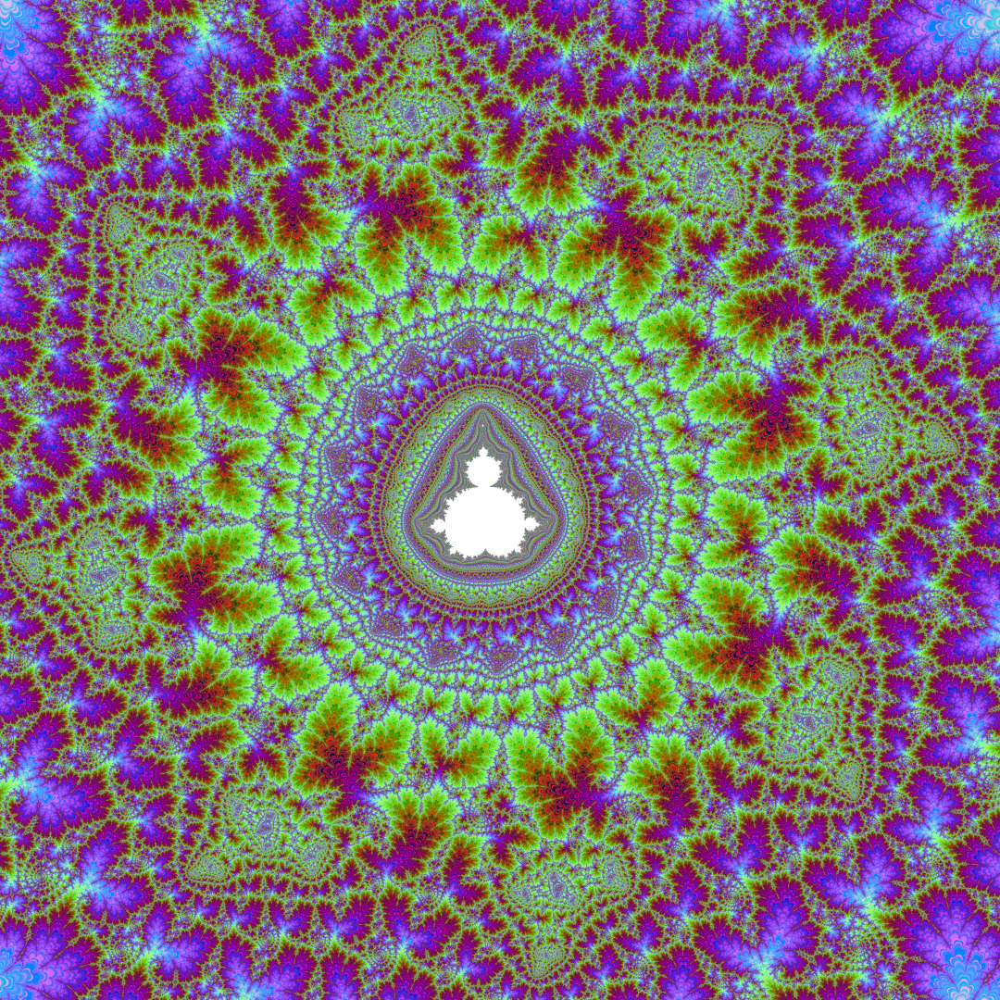

# Mandelbrot set fragment.

## Palette Generation Logic
The palette generation is done here. 0 is Green, 1 is Blue, and 2 is Red.

```pascal
pal[a][0]:=round(127+127cos(2pia/255));
pal[a][1]:=round(127+127sin(2pia/255));
pal[a][2]:=Random(256)
```
## The Problem: 8-bit Banding
Where are the images? I want to see the Mandelbrot set! But here is where it gets interesting.
If you look at most programs, you will see a major issue: only 256 colors and ugly "steps"
between color transitions (the so-called **color banding**). I couldn't look at it without pain.

What do other developers do? I studied popular projects:
*   [Kalles Fraktaler 2](https://mathr.co.uk) - Legendary program for deep zooming.
*   [Mandelbrot & Julia Sets](https://www.juliasets.dk) - Huge theory and image database.
*   [Mandelbrot Viewer (Java)](https://math.hws.edu) - Interactive online viewer.
*   [Ultra Fractal](https://www.ultrafractal.com) - Professional tool for fractal art.
*   [XaoS](https://xaos-project.github.io) - Fast open-source fractal zoomer.

Four out of five are static! Only XaoS offers animation. But all of them are limited by a 256-color palette.
I don't like that!

## My Solution: TrueColor & 8x8 SuperSampling
I decided to reach a completely different level of quality. I implemented **True SuperSampling
(Anti-aliasing)** with an **8x8 grid** (that's 64 passes per single pixel!!!). 

Instead of a standard **1920 x 1080** image, the engine calculates a massive **15360 x 8640** field! 
Then, these 64 samples are downscaled into a single pixel, creating smooth **24-bit TrueColor** transitions
instead of crunchy 8-bit steps. Everything is powered by **OpenMP** parallel loops for maximum performance.
OpenMP - Scalability: Your code will run equally efficiently on a 4-core laptop and a 128-core server without any program modifications.

## Look at the results! The smoothness is incredible. 
Creates an executable file and creates Mandelbrot.bmp




**[Download Latest Version (Windows & Linux)](https://github.com/Divetoxx/Mandelbrot/releases)**


## Логика генерации палитры
Генерация палитры сделана вот. 0 - это Green, 1 - это Blue и 2 - это Red.

```pascal
pal[a][0]:=round(127+127*cos(2*pi*a/255));
pal[a][1]:=round(127+127*sin(2*pi*a/255));
pal[a][2]:=Random(256)
```

## Проблема: 8-битная полосовая модуляция
Но где же сами изображения? Я хочу увидеть Множество Мандельброта!
И вот тут начинается самое интересное. Если вы посмотрите на большинство программ, вы увидите проблему: всего 256 цветов
и явные <ступеньки> между цветовыми переходами (так называемый цветовой бандинг).
Я не смог на это смотреть без боли. А что же делают другие разработчики? Я изучил популярные проекты:

## Другие проекты о фракталах
*   [Kalles Fraktaler 2](https://mathr.co.uk/kf/kf.html) - легендарная программа для глубокого зума.
*   [Mandelbrot & Julia Sets](https://www.juliasets.dk/Mandelbrot.htm) - большая база теории и изображений.
*   [Mandelbrot Viewer (Java)](https://math.hws.edu/eck/js/mandelbrot/java/MandelbrotSettings/) - интерактивный онлайн-просмотрщик.
*   [Ultra Fractal](https://www.ultrafractal.com/) - профессиональный инструмент для создания фрактального искусства.
*   [XaoS](https://xaos-project.github.io/) - быстрый фрактальный зуммер с открытым кодом.

Четыре из пяти проектов вообще статичны! Только пятый, Xaos, предлагает анимацию. Но все они ограничены палитрой в 256 цветов.

## Мое решение: TrueColor и суперсэмплинг 8x8
Мне это не нравится! И я решил - будет совершенно другой уровень качества! Я реализовал честный суперсэмплинг (антиалиасинг)
- со сглаживанием 8x8 (64 прохода на один пиксель!!!)
То есть не **1920 на 1080** пикселя а в 8x8 больше! **15360 на 8640** пикселя! А потом эти 64 прохода уменьшают на один пиксель но плавно -
и уже не 8-битного а 24-битного цвета TrueColor!

И тоже параллельный цикл OpenMP. OpenMP - масштабируемость: ваш код будет одинаково эффективно работать как на 4-ядерном ноутбуке,
так и на 128-ядерном сервере без каких-либо изменений в программе.

Но самое главное - КАРТИНКИ ))) Смотрите:

## Посмотрите на результаты! Невероятная плавность работы.
Создает исполняемый файл и файл Mandelbrot.bmp


**[Скачать последнюю версию (Windows и Linux)](https://github.com/Divetoxx/Mandelbrot/releases)**


