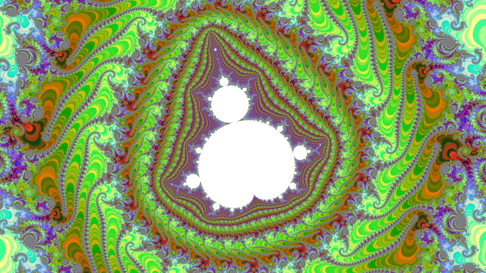

[English](#english) | [Русский](#russian)
<a name="english"></a>

# Mandelbrot set. Supersampling 64 passes per pixel!

## Palette Generation Logic
The palette generation is done here. 0 is Green, 1 is Blue, and 2 is Red.

```pascal
pal[a][0]:=round(127+127cos(2pia/255));
pal[a][1]:=round(127+127sin(2pia/255));
pal[a][2]:=Random(256)
```
## The Problem: 8-bit Banding
Where are the images? I want to see the Mandelbrot set! But here is where it gets interesting.
If you look at most programs, you will see a major issue: only 256 colors and ugly "steps"
between color transitions (the so-called **color banding**). I couldn't look at it without pain.

What do other developers do? I studied popular projects:
*   [Kalles Fraktaler 2](https://mathr.co.uk) - Legendary program for deep zooming.
*   [Mandelbrot & Julia Sets](https://www.juliasets.dk) - Huge theory and image database.
*   [Mandelbrot Viewer (Java)](https://math.hws.edu) - Interactive online viewer.
*   [Ultra Fractal](https://www.ultrafractal.com) - Professional tool for fractal art.
*   [XaoS](https://xaos-project.github.io) - Fast open-source fractal zoomer.

Four out of five are static! Only XaoS offers animation. But all of them are limited by a 256-color palette.
I don't like that!

## My Solution: TrueColor & 8x8 SuperSampling
I decided to reach a completely different level of quality. I implemented **True SuperSampling
(Anti-aliasing)** with an **8x8 grid** (that's 64 passes per single pixel!!!). 

Instead of a standard **1920 x 1080** image, the engine calculates a massive **15360 x 8640** field! 
Then, these 64 samples are downscaled into a single pixel, creating smooth **24-bit TrueColor** transitions
instead of crunchy 8-bit steps. 

## OpenMP
OpenMP is a standard that tells the compiler, "Take this loop and distribute the iterations among the different processor cores."
Yes, using OpenMP you are doing parallel programming at the Multithreading level.
Everything is powered by **OpenMP** parallel loops for maximum performance.
OpenMP - Scalability: Your code will run equally efficiently on a 4-core laptop and a 128-core server.

## Look at the results! The smoothness is incredible 





1-5 is one of five different locations on the Mandelbrot set. When you select one, the program will generate a TrueColor 1920 x 1080 Mandelbrot.bmp.

```C++
absc = -1.39966699645936; ordi = 0.0005429083913; size_val = 0.000000000000036;
absc = -0.5503321035926785; ordi = 0.62593891595488; size_val = 0.00000000000026;
absc = -1.39968383250956; ordi = -0.000552555016; size_val = 0.000000000026;
absc = -0.8069595889803; ordi = -0.1593850218137; size_val = 0.00000000007;
absc = -0.6187324844067; ordi = -0.4566028912292; size_val = 0.00000000025;
```

A 6 - reads Mandelbrot.txt - three lines from the file and IT will be TrueColor 1920 by 1080 Mandelbrot.bmp


## High-Precision Rendering (80-bit vs 64-bit)

Most Mandelbrot explorers use standard **64-bit double precision**, which leads to "pixelation" and math collapse at zoom levels around $10^{14}$. 
This project leverages **80-bit Extended Precision Arithmetic** (`long double`) to push the boundaries of the fractal:

*   **Standard Double (64-bit):** Fails at deep zoom, turning the fractal into a blurry mess.
*   **My Implementation (80-bit):** Provides **4 extra decimal digits** of precision, allowing you to explore **10,000x deeper** ($10^{18}$ range).
*   **Hardware Optimized:** Directly utilizes the **x87 FPU registers** for maximum mathematical depth.

**[Download Latest Version (Windows & Linux)](https://github.com/Divetoxx/Mandelbrot/releases)**


<a name="russian"></a>
# Множество Мандельброта. Суперсэмплинг 64 прохода на пиксель!

## Логика генерации палитры
Генерация палитры сделана вот. 0 - это Green, 1 - это Blue и 2 - это Red.

```pascal
pal[a][0]:=round(127+127*cos(2*pi*a/255));
pal[a][1]:=round(127+127*sin(2*pi*a/255));
pal[a][2]:=Random(256)
```

## Проблема: 8-битная полосовая модуляция
Но где же сами изображения? Я хочу увидеть Множество Мандельброта!
И вот тут начинается самое интересное. Если вы посмотрите на большинство программ, вы увидите проблему: всего 256 цветов
и явные "ступеньки" между цветовыми переходами (так называемый цветовой бандинг).
Я не смог на это смотреть без боли. А что же делают другие разработчики? Я изучил популярные проекты:

## Другие проекты о фракталах
*   [Kalles Fraktaler 2](https://mathr.co.uk/kf/kf.html) - легендарная программа для глубокого зума.
*   [Mandelbrot & Julia Sets](https://www.juliasets.dk/Mandelbrot.htm) - большая база теории и изображений.
*   [Mandelbrot Viewer (Java)](https://math.hws.edu/eck/js/mandelbrot/java/MandelbrotSettings/) - интерактивный онлайн-просмотрщик.
*   [Ultra Fractal](https://www.ultrafractal.com/) - профессиональный инструмент для создания фрактального искусства.
*   [XaoS](https://xaos-project.github.io/) - быстрый фрактальный зуммер с открытым кодом.

Четыре из пяти проектов вообще статичны! Только пятый, Xaos, предлагает анимацию. Но все они ограничены палитрой в 256 цветов.

## Мое решение: TrueColor и суперсэмплинг 8x8
Мне это не нравится! И я решил - будет совершенно другой уровень качества! Я реализовал честный суперсэмплинг (антиалиасинг) - со
сглаживанием 8x8 (64 прохода на один пиксель!!!)
То есть не **1920 на 1080** пикселя а в 8x8 больше! **15360 на 8640** пикселя! А потом эти 64 прохода уменьшают на один пиксель но плавно -
и уже не 8-битного а 24-битного цвета TrueColor!

## OpenMP
OpenMP - это стандарт, который говорит компилятору: "Возьми этот цикл и сам раздай итерации разным ядрам процессора".
Используя OpenMP, вы занимаетесь параллельным программированием на уровне многопоточности (Multithreading).
OpenMP - масштабируемость: ваш код будет одинаково эффективно работать как на 4-ядерном ноутбуке,
так и на 128-ядерном сервере.

## Посмотрите на результаты! Невероятная плавность работы


С 1-5 - это одно из пяти разных мест Множество Мандельброта. Когда вы выберите одно, то программа будет TrueColor 1920 на 1080 делать Mandelbrot.bmp 

```C++
absc = -1.39966699645936; ordi = 0.0005429083913; size_val = 0.000000000000036;
absc = -0.5503321035926785; ordi = 0.62593891595488; size_val = 0.00000000000026;
absc = -1.39968383250956; ordi = -0.000552555016; size_val = 0.000000000026;
absc = -0.8069595889803; ordi = -0.1593850218137; size_val = 0.00000000007;
absc = -0.6187324844067; ordi = -0.4566028912292; size_val = 0.00000000025;
```

А 6 - читает Mandelbrot.txt - три строки из файла и ЕГО будет TrueColor 1920 на 1080 делать Mandelbrot.bmp


## Высокоточная отрисовка (80-бит против 64-бит)
Большинство исследователей фрактала Мандельброта используют стандартную **64-битную двойную точность**,
что приводит к "пикселизации" и коллапсу математических вычислений при масштабировании около $10^{14}$.

В этом проекте используется **80-битная арифметика с расширенной точностью** (<long double>) для расширения границ фрактала:

* **Стандартная двойная точность (64-бит):** Не работает при глубоком масштабировании, превращая фрактал в размытое изображение.
* **Моя реализация (80-бит):** Обеспечивает **4 дополнительных десятичных знака** точности, позволяя исследовать **в 10 000 раз глубже** (диапазон $10^{18}$).
* **Аппаратная оптимизация:** Непосредственно использует **регистры FPU x87** для максимальной глубины математических вычислений.


**[Скачать последнюю версию (Windows и Linux)](https://github.com/Divetoxx/Mandelbrot/releases)**

